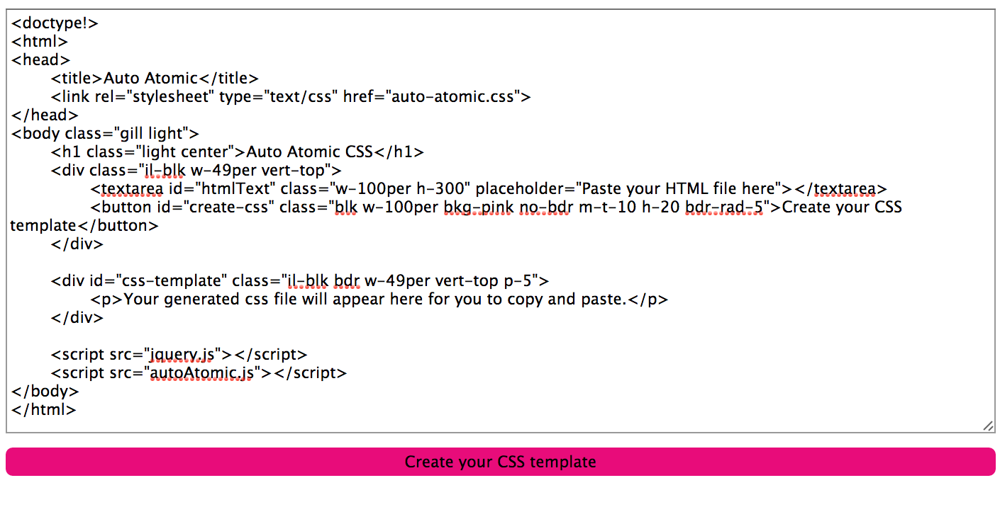
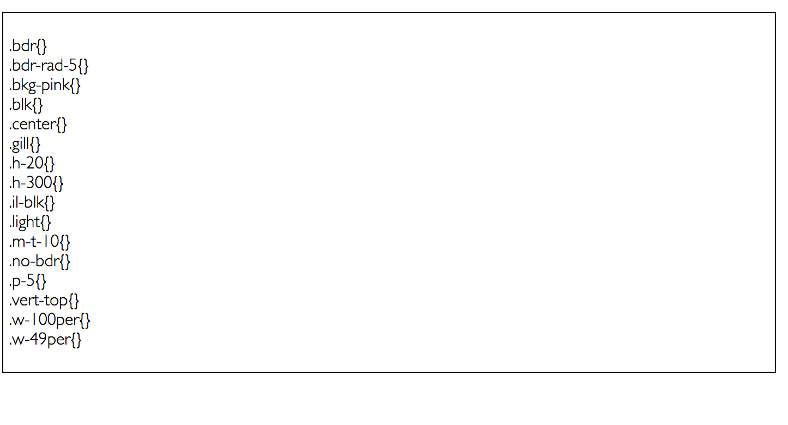
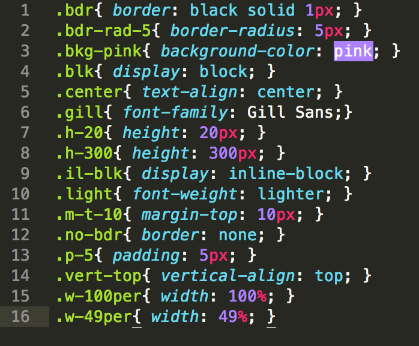

#Auto Atomic

Rather than jumping back and forth between your html and css files. Write all the atomic style classes in your html, then use this to generate your css template on the class names. 

##Step 1: Paste in your HTML

##Step 2: Generate CSS template

##Step 3: Fill in CSS template

